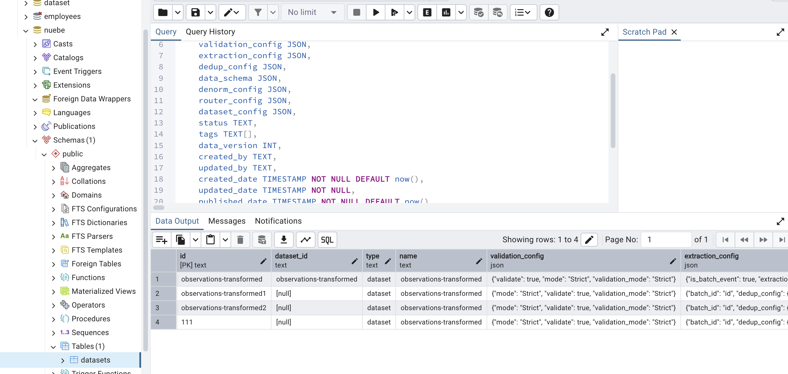
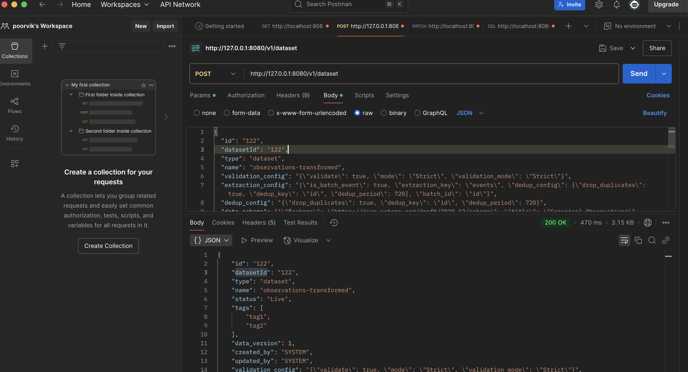
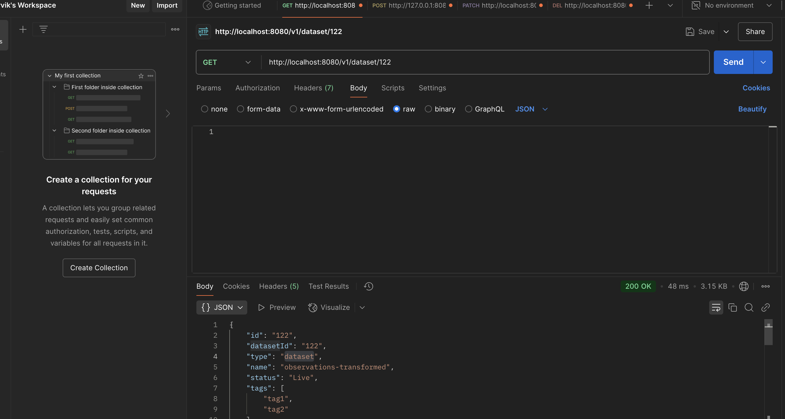
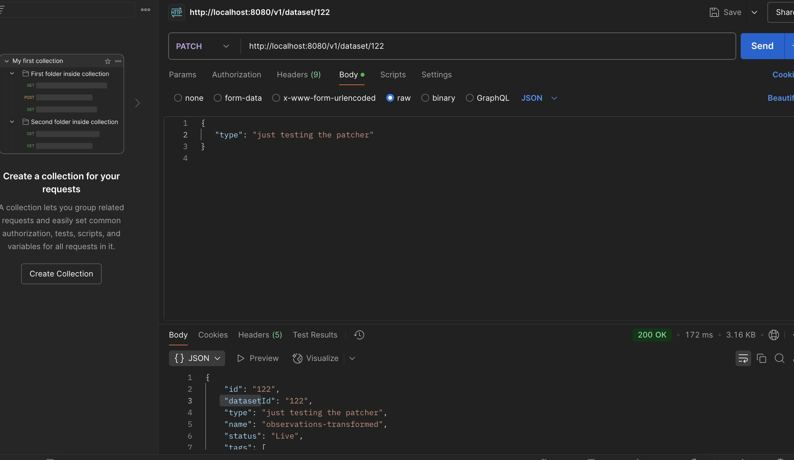

### Post request
The nested JSON is converted to string for correct desceralization of values

```
THe error if we dont convert to the nested key and value pairs in the request body

2025-04-02T09:22:08.828+05:30  WARN 97702 --- [newbuilder] [nio-8080-exec-9] .w.s.m.s.DefaultHandlerExceptionResolver : Resolved [org.springframework.http.converter.HttpMessageNotReadableException: JSON parse error: Cannot deserialize value of type `java.lang.String` from Object value (token `JsonToken.START_OBJECT`)]
2025-04-02T09:22:42.890+05:30  WARN 97702 --- [newbuilder] [io-8080-exec-10] .w.s.m.s.DefaultHandlerExceptionResolver : Resolved [org.springframework.http.converter.HttpMessageNotReadableException: JSON parse error: Cannot deserialize value of type `java.lang.String` from Object value (token `JsonToken.START_OBJECT`)]
```


```
The reformated structure


{
  "id": "174",
  "datasetId": "174",
  "type": "dataset",
  "name": "observations-transformed",
  "validation_config": "{\"validate\": true, \"mode\": \"Strict\", \"validation_mode\": \"Strict\"}",
  "extraction_config": "{\"is_batch_event\": true, \"extraction_key\": \"events\", \"dedup_config\": {\"drop_duplicates\": true, \"dedup_key\": \"id\", \"dedup_period\": 720}, \"batch_id\": \"id\"}",
  "dedup_config": "{\"drop_duplicates\": true, \"dedup_key\": \"id\", \"dedup_period\": 720}",
  "data_schema": "{\"$schema\": \"https://json-schema.org/draft/2020-12/schema\", \"title\": \"Canonical Observations\", \"description\": \"A canonical observation\", \"type\": \"object\", \"properties\": {\"obsCode\": {\"type\": \"string\"}, \"codeComponents\": {\"type\": \"array\", \"items\": {\"type\": \"object\", \"properties\": {\"componentCode\": {\"type\": \"string\"}, \"componentType\": {\"type\": \"string\", \"enum\": [\"AGG_TIME_WINDOW\", \"AGG_METHOD\", \"PARAMETER\", \"FEATURE_OF_INTEREST\", \"OBS_PROPERTY\", \"SAMPLING_STRATEGY\", \"OBS_METHOD\", \"METADATA\", \"METADATA_DEVICE\", \"DATA_QUALITY\", \"EVENT\", \"FOI_CONTEXT\"]}, \"selector\": {\"type\": \"string\"}, \"value\": {\"type\": \"string\"}, \"valueUoM\": {\"type\": \"string\"}}}}, \"valueUoM\": {\"type\": \"string\"}, \"value\": {\"type\": \"string\"}, \"id\": {\"type\": \"string\"}, \"parentCollectionRef\": {\"type\": \"string\"}, \"integrationAccountRef\": {\"type\": \"string\"}, \"assetRef\": {\"type\": \"string\"}, \"xMin\": {\"type\": \"number\"}, \"xMax\": {\"type\": \"number\"}, \"yMin\": {\"type\": \"number\"}, \"yMax\": {\"type\": \"number\"}, \"phenTime\": {\"type\": \"string\", \"format\": \"date-time\", \"suggestions\": [{\"message\": \"The Property 'phenTime' appears to be 'date-time' format type.\", \"advice\": \"The System can index all data on this column\", \"resolutionType\": \"INDEX\", \"severity\": \"LOW\"}]}, \"phenEndTime\": {\"type\": \"string\", \"format\": \"date-time\", \"suggestions\": [{\"message\": \"The Property 'phenEndTime' appears to be 'date-time' format type.\", \"advice\": \"The System can index all data on this column\", \"resolutionType\": \"INDEX\", \"severity\": \"LOW\"}]}, \"spatialExtent\": {\"type\": \"string\"}, \"modified\": {\"type\": \"number\"}}, \"required\": [\"id\", \"parentCollectionRef\", \"integrationAccountRef\", \"obsCode\", \"phenTime\", \"value\"]}",
  "denorm_config": "{\"redis_db_host\": \"192.168.106.2\", \"redis_db_port\": 6379, \"denorm_fields\": [{\"denorm_key\": \"assetRef\", \"redis_db\": 3, \"denorm_out_field\": \"assetMeta\"}, {\"denorm_key\": \"integrationAccountRef\", \"redis_db\": 4, \"denorm_out_field\": \"providerMeta\"}]}",
  "router_config": "{\"topic\": \"observations-transformed\"}",
  "dataset_config": "{\"data_key\": \"\", \"timestamp_key\": \"phenTime\", \"exclude_fields\": [], \"entry_topic\": \"local.ingest\", \"redis_db_host\": \"192.168.106.2\", \"redis_db_port\": 6379, \"index_data\": true, \"redis_db\": 0}",
  "tags": ["tag1", "tag2"],
  "data_version": 1,
  "status": "Live",
  "created_by": "SYSTEM",
  "updated_by": "SYSTEM",
  "created_date": "2023-04-24T10:30:47.263",
  "updated_date": "2023-04-24T10:30:47.263",
  "published_date": "2023-04-24T10:30:47.263"
}

```

### Post response:

### Response json for post request.
```
{
    "id": "174",
    "datasetId": "174",
    "type": "dataset",
    "name": "observations-transformed",
    "status": "Live",
    "tags": [
        "tag1",
        "tag2"
    ],
    "data_version": 1,
    "created_by": "SYSTEM",
    "updated_by": "SYSTEM",
    "created_date": "2023-04-24T10:30:47.263",
    "updated_date": "2023-04-24",
    "published_date": "2023-04-24T10:30:47.263",
    "validation_config": "{\"validate\": true, \"mode\": \"Strict\", \"validation_mode\": \"Strict\"}",
    "extraction_config": "{\"is_batch_event\": true, \"extraction_key\": \"events\", \"dedup_config\": {\"drop_duplicates\": true, \"dedup_key\": \"id\", \"dedup_period\": 720}, \"batch_id\": \"id\"}",
    "dedup_config": "{\"drop_duplicates\": true, \"dedup_key\": \"id\", \"dedup_period\": 720}",
    "data_schema": "{\"$schema\": \"https://json-schema.org/draft/2020-12/schema\", \"title\": \"Canonical Observations\", \"description\": \"A canonical observation\", \"type\": \"object\", \"properties\": {\"obsCode\": {\"type\": \"string\"}, \"codeComponents\": {\"type\": \"array\", \"items\": {\"type\": \"object\", \"properties\": {\"componentCode\": {\"type\": \"string\"}, \"componentType\": {\"type\": \"string\", \"enum\": [\"AGG_TIME_WINDOW\", \"AGG_METHOD\", \"PARAMETER\", \"FEATURE_OF_INTEREST\", \"OBS_PROPERTY\", \"SAMPLING_STRATEGY\", \"OBS_METHOD\", \"METADATA\", \"METADATA_DEVICE\", \"DATA_QUALITY\", \"EVENT\", \"FOI_CONTEXT\"]}, \"selector\": {\"type\": \"string\"}, \"value\": {\"type\": \"string\"}, \"valueUoM\": {\"type\": \"string\"}}}}, \"valueUoM\": {\"type\": \"string\"}, \"value\": {\"type\": \"string\"}, \"id\": {\"type\": \"string\"}, \"parentCollectionRef\": {\"type\": \"string\"}, \"integrationAccountRef\": {\"type\": \"string\"}, \"assetRef\": {\"type\": \"string\"}, \"xMin\": {\"type\": \"number\"}, \"xMax\": {\"type\": \"number\"}, \"yMin\": {\"type\": \"number\"}, \"yMax\": {\"type\": \"number\"}, \"phenTime\": {\"type\": \"string\", \"format\": \"date-time\", \"suggestions\": [{\"message\": \"The Property 'phenTime' appears to be 'date-time' format type.\", \"advice\": \"The System can index all data on this column\", \"resolutionType\": \"INDEX\", \"severity\": \"LOW\"}]}, \"phenEndTime\": {\"type\": \"string\", \"format\": \"date-time\", \"suggestions\": [{\"message\": \"The Property 'phenEndTime' appears to be 'date-time' format type.\", \"advice\": \"The System can index all data on this column\", \"resolutionType\": \"INDEX\", \"severity\": \"LOW\"}]}, \"spatialExtent\": {\"type\": \"string\"}, \"modified\": {\"type\": \"number\"}}, \"required\": [\"id\", \"parentCollectionRef\", \"integrationAccountRef\", \"obsCode\", \"phenTime\", \"value\"]}",
    "denorm_config": "{\"redis_db_host\": \"192.168.106.2\", \"redis_db_port\": 6379, \"denorm_fields\": [{\"denorm_key\": \"assetRef\", \"redis_db\": 3, \"denorm_out_field\": \"assetMeta\"}, {\"denorm_key\": \"integrationAccountRef\", \"redis_db\": 4, \"denorm_out_field\": \"providerMeta\"}]}",
    "router_config": "{\"topic\": \"observations-transformed\"}",
    "dataset_config": "{\"data_key\": \"\", \"timestamp_key\": \"phenTime\", \"exclude_fields\": [], \"entry_topic\": \"local.ingest\", \"redis_db_host\": \"192.168.106.2\", \"redis_db_port\": 6379, \"index_data\": true, \"redis_db\": 0}"
}

```


### Patch
### http://localhost:8080/v1/dataset/172
```
{
   "type": "just testing the patcher172"
}

```

### patch response
```
{
    "id": "172",
    "datasetId": "172",
    "type": "just testing the patcher172",
    "name": "observations-transformed",
    "status": "Live",
    "tags": [
        "tag1",
        "tag2"
    ],
    "data_version": 1,
    "created_by": "SYSTEM",
    "updated_by": "SYSTEM",
    "created_date": "2023-04-24T10:30:47.263",
    "updated_date": "2023-04-24",
    "published_date": "2023-04-24T10:30:47.263",
    "validation_config": "{\"mode\": \"Strict\", \"validate\": true, \"validation_mode\": \"Strict\"}",
    "extraction_config": "{\"batch_id\": \"id\", \"dedup_config\": {\"dedup_key\": \"id\", \"dedup_period\": 720, \"drop_duplicates\": true}, \"extraction_key\": \"events\", \"is_batch_event\": true}",
    "dedup_config": "{\"dedup_key\": \"id\", \"dedup_period\": 720, \"drop_duplicates\": true}",
    "data_schema": "{\"type\": \"object\", \"title\": \"Canonical Observations\", \"$schema\": \"https://json-schema.org/draft/2020-12/schema\", \"required\": [\"id\", \"parentCollectionRef\", \"integrationAccountRef\", \"obsCode\", \"phenTime\", \"value\"], \"properties\": {\"id\": {\"type\": \"string\"}, \"xMax\": {\"type\": \"number\"}, \"xMin\": {\"type\": \"number\"}, \"yMax\": {\"type\": \"number\"}, \"yMin\": {\"type\": \"number\"}, \"value\": {\"type\": \"string\"}, \"obsCode\": {\"type\": \"string\"}, \"assetRef\": {\"type\": \"string\"}, \"modified\": {\"type\": \"number\"}, \"phenTime\": {\"type\": \"string\", \"format\": \"date-time\", \"suggestions\": [{\"advice\": \"The System can index all data on this column\", \"message\": \"The Property 'phenTime' appears to be 'date-time' format type.\", \"severity\": \"LOW\", \"resolutionType\": \"INDEX\"}]}, \"valueUoM\": {\"type\": \"string\"}, \"phenEndTime\": {\"type\": \"string\", \"format\": \"date-time\", \"suggestions\": [{\"advice\": \"The System can index all data on this column\", \"message\": \"The Property 'phenEndTime' appears to be 'date-time' format type.\", \"severity\": \"LOW\", \"resolutionType\": \"INDEX\"}]}, \"spatialExtent\": {\"type\": \"string\"}, \"codeComponents\": {\"type\": \"array\", \"items\": {\"type\": \"object\", \"properties\": {\"value\": {\"type\": \"string\"}, \"selector\": {\"type\": \"string\"}, \"valueUoM\": {\"type\": \"string\"}, \"componentCode\": {\"type\": \"string\"}, \"componentType\": {\"enum\": [\"AGG_TIME_WINDOW\", \"AGG_METHOD\", \"PARAMETER\", \"FEATURE_OF_INTEREST\", \"OBS_PROPERTY\", \"SAMPLING_STRATEGY\", \"OBS_METHOD\", \"METADATA\", \"METADATA_DEVICE\", \"DATA_QUALITY\", \"EVENT\", \"FOI_CONTEXT\"], \"type\": \"string\"}}}}, \"parentCollectionRef\": {\"type\": \"string\"}, \"integrationAccountRef\": {\"type\": \"string\"}}, \"description\": \"A canonical observation\"}",
    "denorm_config": "{\"denorm_fields\": [{\"redis_db\": 3, \"denorm_key\": \"assetRef\", \"denorm_out_field\": \"assetMeta\"}, {\"redis_db\": 4, \"denorm_key\": \"integrationAccountRef\", \"denorm_out_field\": \"providerMeta\"}], \"redis_db_host\": \"192.168.106.2\", \"redis_db_port\": 6379}",
    "router_config": "{\"topic\": \"observations-transformed\"}",
    "dataset_config": "{\"data_key\": \"\", \"redis_db\": 0, \"index_data\": true, \"entry_topic\": \"local.ingest\", \"redis_db_host\": \"192.168.106.2\", \"redis_db_port\": 6379, \"timestamp_key\": \"phenTime\", \"exclude_fields\": []}"
}

```




### the above null valuse are caused due to not using the correct variable name in postman.





### FIXES

```
@maju -->fix 1
There is a issue where we were not able to send data without adding a trailing \\\" in the data structure .
but when we changed the data type from String to MAP<String ,Object > the issue got fixed. 
```